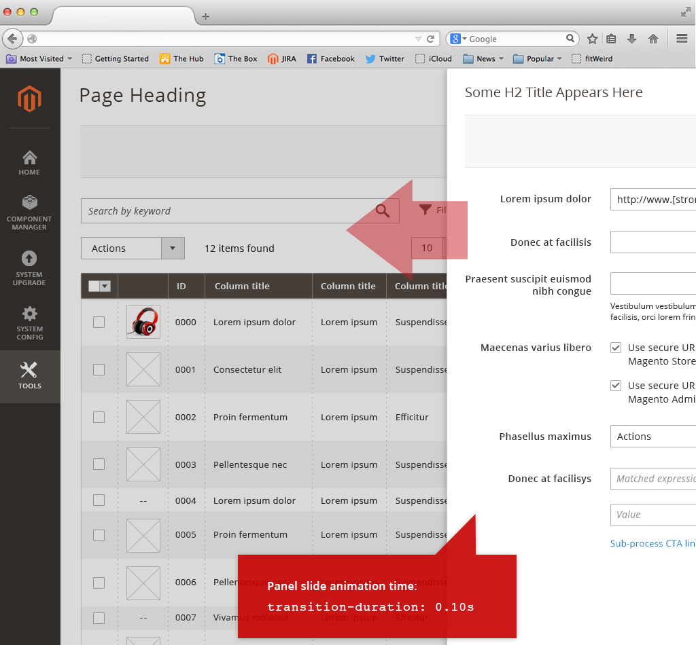
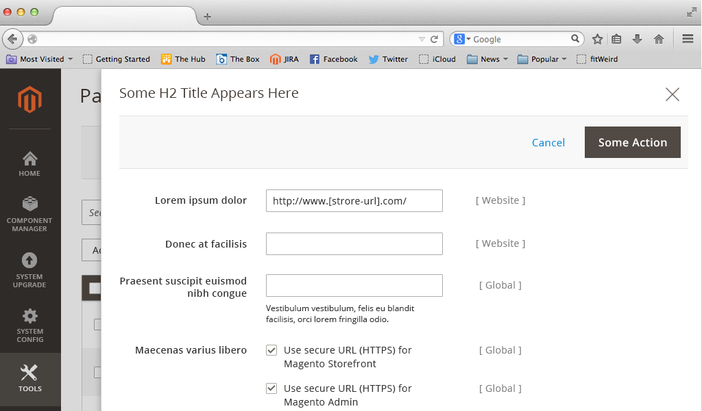
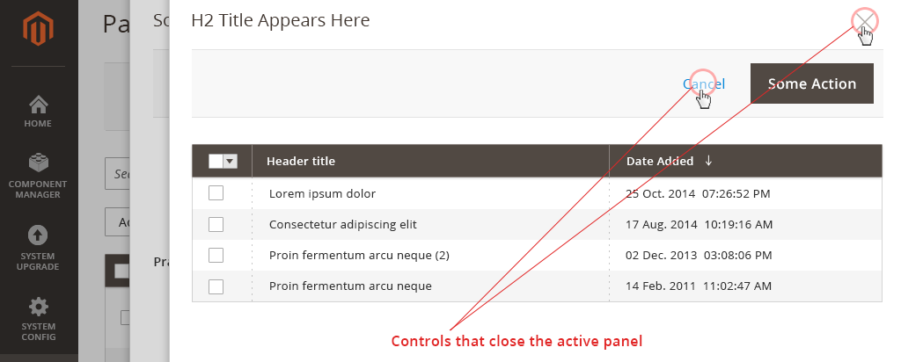
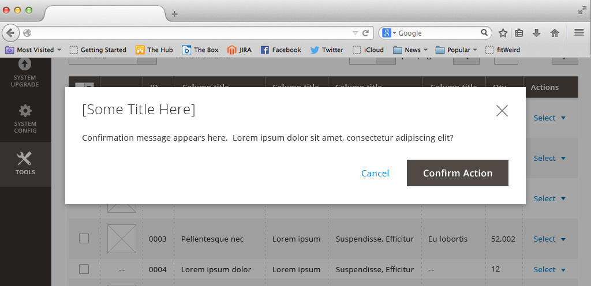
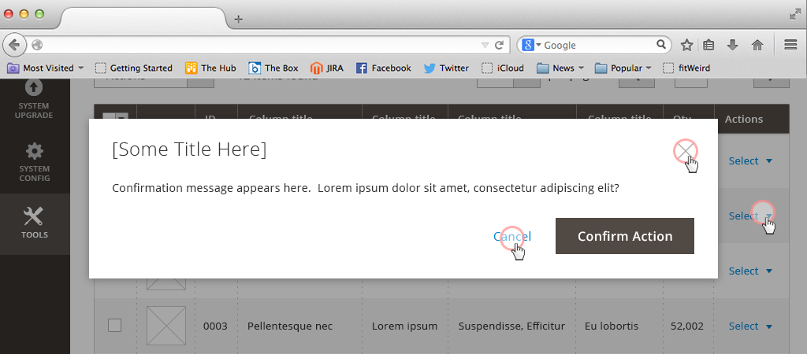
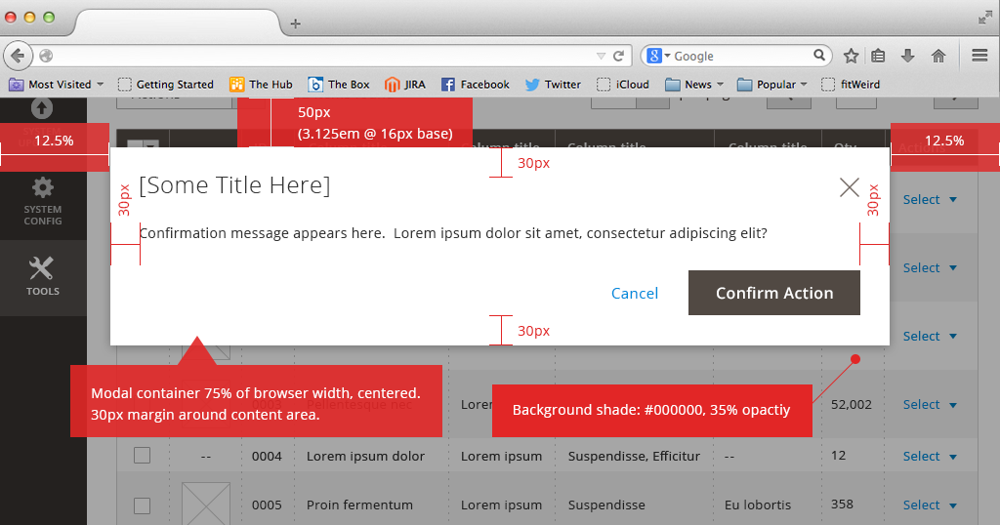
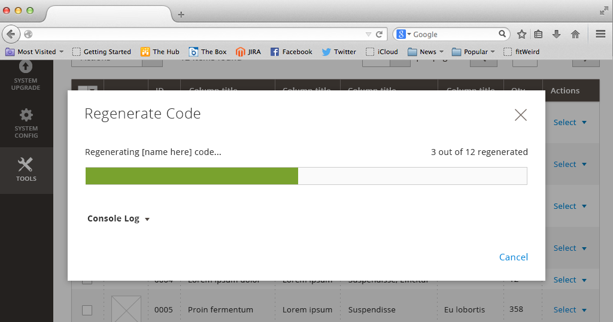
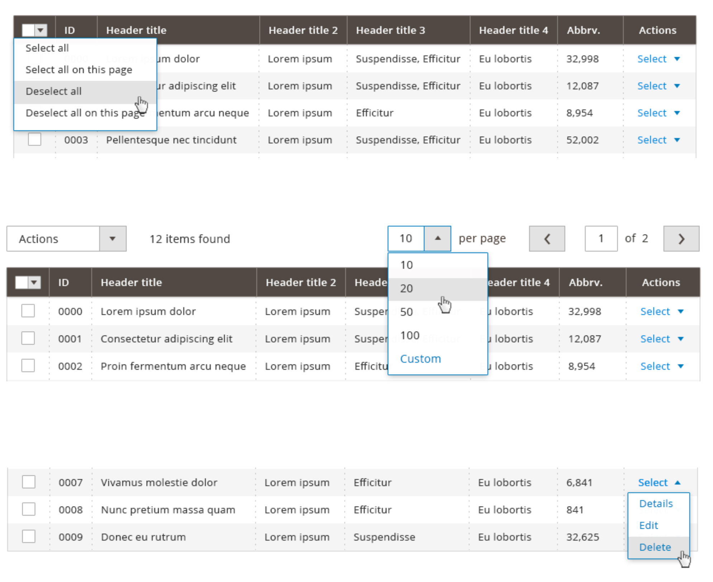
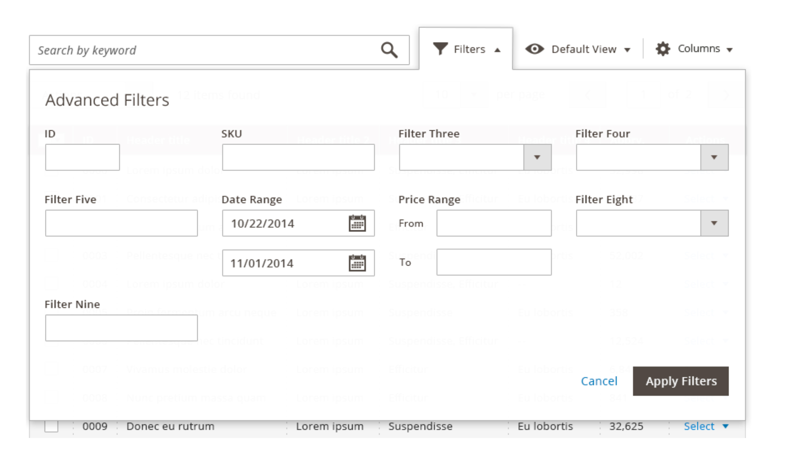
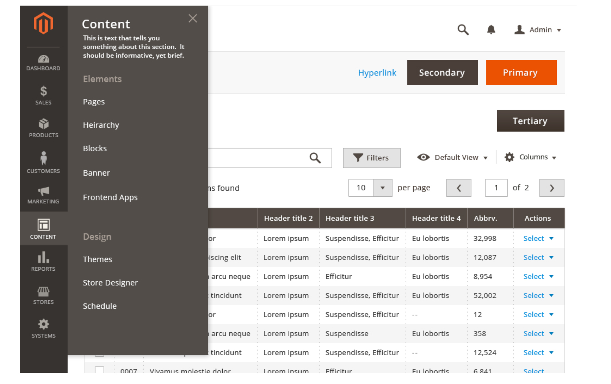

# Slide-out panesl, modal windows, and overlays

It is often necessary to focus the user’s attention on some particular bit of content or isolated action, process or sub-process. A "Slide-out Panel", "Modal Window" or "Overlay" is an effective way to achieve this. These are triggered by a particular user action causing their current task to be interrupted. The user must then take some required action to be returned to their primary task and continue (in most cases). The active state of any of overlays should occupy the topmost level of the z-index.

For solutions not described in this article or for further information, please contact the Commerce UX Design team.

## Use of Slide-out Panels (aka "Slideouts")

Slide-out panels should be used for tertiary actions or sub-processes related to the user’s primary path. These panels allow for greater content and/or more complex interactions thus behaving much like an additional webpage while maintaining a contextual connection to the primary task.

## Use of Modal Windows (aka "Modals")

Modal windows are best used to focus attention either on some particular content (such as a video), or to confirm an action or decision (such as "Do you wish to delete the selected files"). Typically modals should be used when the information presented is more concise and the interactions are less complex (than that used in slideouts).

## Use of Modal Overlay

Overlays, for the purposes of this document, generally refer to any content that appears over the primary page when triggered. Overlays also refer more specifically to those containers used to present actions, navigation, filtering options, tooltips and contextual help, messages, etc.  See examples below.

## Slide-out

### Behavior and Animation

When the slideout is triggered (by an action taken on the "parent page"), the panel will appear to slide into position in the viewport from right-to-left. The panel should be attached to the top of the browser and match the length of the parent page. In its final position, the panel should not fully obscure the parent page, leaving a portion of the lower parent page in view. The lower parent page is disabled when the slideout is active. This is achieved by covering the parent page with a transparent shade. The page-over-page appearance will help focus the user’s attention on the active sub-task while providing context of this "interruption" to the primary task.

Example of panel animation

### Anatomy of Slideout

The active panel should include the following elements:

*  Content container (Panel)
*  A Page title
*  Close control "×" (ESC-key via keyboard)
*  Button bar for actions, including a "Cancel" (ESC-key is Cancel via keyboard)
*  Page content
*  "Shade" to disable lower level page

Example of active panel positioned over "parent"

### Cancel and Close controls

The close control ( × ) and the "Cancel" link/button will cancel the sub-process, close the panel and return the user to their primary path. The ESC-key via keyboard will close/cancel the upper-most open panel.

Close and cancel controls

### Passive Close

The user may also click or tap in the "alley" (shaded area) to the left of the active panel to cancel/close the panel. This passive control allows the user to drill down to the desired level without the need to close each panel via the cancel or close controls.

When two panels are open (one over the other), only the topmost is active. Clicking or tapping the in the "alley" (on the edge of the lower panel) the top active panel closes, making the panel underneath active.

Passive close "zone" - one level down

Clicking or tapping the "alley" that represents the parent page (lowest level) will slide each panel out of view, closing them, and return the user to the parent page. It is recommended that no more than two panels be used in any given "task flow".

Passive close "zone" - two levels down

### Slideout Button Bar actions

Actions in the Slideout Button Bar follow the [Button Bar pattern](../controls/button-bar.md).
There are two general ways of using Slideout — "Subflow" and "Extend Form".

### Sub Flow

If the form in slide-in panel creates new entities, or changes existing ones (Create Product Configurations, Add Attribute) primary action in the Slideout Button Bar should be a noun explaining the panel resulting action: "Generate Configurations", "Create Attribute", etc.
Clicking that button will:

1. Validate the form in Slideout. If form has errors, it will show the error messages following the Error Messaging Pattern. If no errors found, it will:
1. Close the Slideout and apply changes immediately (entity will be created in the database, for example).

### Extend Form

If the Slideout panel is a part of the form, extending it (like Advanced Inventory, or Advanced Pricing), primary action should be labeled as "Done". Clicking it will:

1. Validate the form in Slideout. If form has errors, it will show the error messages following the Error Messaging Pattern. If no errors found, it will:
1. Close the Slideout and save the contents of its form. User still has to click "Save" button on the main form to apply changes.

Clicking "Cancel" or clicking "&times;" or clicking outside of the panel (passive close) in both cases should reset contents of the current level Slideout form to default state.
If user made changes to a form, he is presented with the modal window to confirm Cancellation:

Clicking "Yes, Cancel" closes the Modal and Slideout, then resets form to default state. Clicking "Do not Cancel" closes the Modal.

### Slideouts and Page-grids

In its final position the panel does not snap to the page-grid of the parent page, but rather should respect some distance from the left edge of the browser. This distance provides an "alley" that creates a page-over-page metaphor. This distance should be some % of the viewport, rather than a fixed pixel width, to accommodate for variations in browser widths.

Panel position in relation to browser edge

A 12-column page-grid is nested inside the content area of the slideout panel, with an additional 15px of padding added to the left edge.

Nested page-grid with additional padding

This method of nesting a 12-column page-grid inside the slideout panel is repeated with each subsequent panel. This is done so that the panels can easily accommodate established page templates used in the Commerce framework. With each additional panel, the position of the active panel should indent to create the page-over-page metaphor and allow a zone(s) for the passive close interaction mentioned above.

## Modals

### Behavior and Animation

When an action is taken that triggers a modal, the modal window should appear center-aligned in the user’s browser window. The modal should appear to fade in or grow from the center of the screen. The timing of this animation should be set to about 0.3s (see an [example of the animation here](http://tympanus.net/Development/ModalWindowEffects/) ), refer to "FADE IN & SCALE" option). When the modal is triggered, the parent page should become disabled and shaded while the modal is active.

Example of a Confirmation Modal

### Anatomy of a Modal

The active modal should include the following elements:

*  Content container (Modal Window)
*  A Title
*  Close control "×" (ESC-key via keyboard)
*  Page content
*  Call to action(s), including "Cancel" (ESC-key is Cancel via keyboard)
*  "Shade" to disable lower level page

### Cancel and Close controls

Every modal should include a close control ( × ) in the upper right corner as well as a "Cancel" link or button.  Additionally, if the user clicks or taps the shaded area outside of the modal container the modal will cancel and close. The ESC-key via keyboard will close/cancel the active modal window.

Modal "Cancel" and "Close" controls

### Modal Dimensions

The modal should be center-aligned in the user’s browser window and be 75% of the viewport width. The content within the modal window should flex accordingly to the width of the browser window and the modal width.

The distance of the modal to the top of the browser should have a fixed distance and NOT be percentage-based. This will insure that the "title" and top "close control" will be visible if the modal window is taller than the viewport. Within the content area of the modal window itself there should be 30px padding.

Placement and Padding of Modal

Sample of progress bar in modal

### Implementation

Modal windows are implemented by the following [jQuery](https://glossary.magento.com/jquery) widgets:

*  [modal](https://developer.adobe.com/commerce/frontend-core/javascript/jquery-widgets/modal/)
*  [alert](https://developer.adobe.com/commerce/frontend-core/javascript/jquery-widgets/alert/) (extends modal)
*  [confirm](https://developer.adobe.com/commerce/frontend-core/javascript/jquery-widgets/confirm/) (extends modal)
*  [prompt](https://developer.adobe.com/commerce/frontend-core/javascript/jquery-widgets/prompt/) (extends modal)

## Overlays

### Drop downs

Drop down overlays behave just as drop down form elements do. A button or control toggles the drop down opened and closed. Selecting an option from the expanded list selects that option and closes the overlay.

Examples of drop down overlays

### Flyouts

Flyouts are overlays that typically emerge from a link, menu heading, or other control. They are somewhat different than drop downs in that they create a sort of "tab" around the control that triggered them.

Data-table Filtering Flyout

Data-table In-line Editing Flyout

Sub-menu Navigation Flyout

### Contextual Help

Contextual Help is similar to a "tooltip" element, except that it is revealed by clicking or tapping a control and dismissed by tapping again, or by opening another Contextual Help element on the page.

Example of Contextual Help

### Alerts and Messages

It is often necessary and helpful to provide feedback to the user as to the success or failure of an action or process. This feedback may come in the form of client-side validation or server-side validation.

Field Level Validation message

When field level validation is triggered resulting message should appear and persist until the user has taken an action to correct the error (for example, clicks into the form field to re-type an incorrect password).

Data-table with Confirmation Message

## Assets

*  [Download Slide-out Panels PSD source](https://devdocs.magento.com/download/Slide-out-Panels.psd)
*  [Download Modal PSD source](https://devdocs.magento.com/download/Modal.psd)

## Technical Implementation

Technically slideouts and modals are implemented using the [modal widget](https://developer.adobe.com/commerce/frontend-core/javascript/jquery-widgets/modal/) or the [modal UI component](https://developer.adobe.com/commerce/frontend-core/ui-components/components/modal/).
