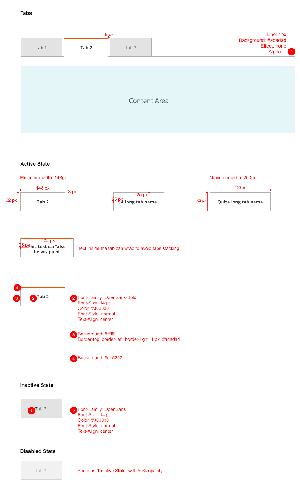
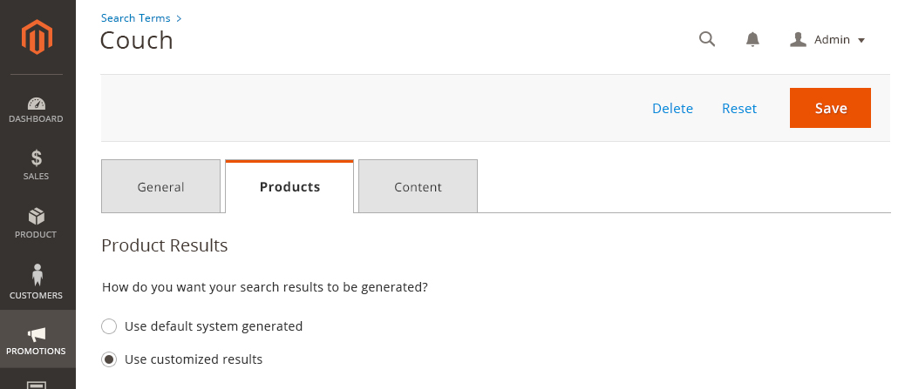

# Tabs

Tabs should be used when the user needs to alternate between views within the same context.

For solutions not described in this article or for further information, please contact the Commerce UX Design Team.

## When to Use

*  When a page has secondary content
*  When the number of sections is able to fit the width of the container without wrapping or being cut off at the edges.
*  When the content for each tab has a similar structure.

## When Not to Use

*  Do not use tabs if the user needs to simultaneously see content from multiple tabs.
*  Do not use tabs if the content of the tab would function more effectively as a separate container or on a separate page.
*  Be cognizant of the type of paradigm that best fits the content. Refer to the expandable containers pattern well and determine the ideal practice.

## Interactions and Behavior

When the user click on a tab, the content area associated with that tab will be shown. There are 3 states that a tab can be:

### Active State

*  Active tab should be "highlighted" to indicate that it's currently active.
*  Should not be clickable while active.

### Inactive State

*  Should be clickable.
*  Should have a hover state.

### Disabled State

When a tab is not clickable for any reason, it should be shown in its disabled state.

## Style

## Example

## Accessibility

User should be able to navigate through each tab with their keyboard.

Follow the rule [Make all functionality available from a keyboard](https://www.w3.org/TR/UNDERSTANDING-WCAG20/keyboard-operation.html).
