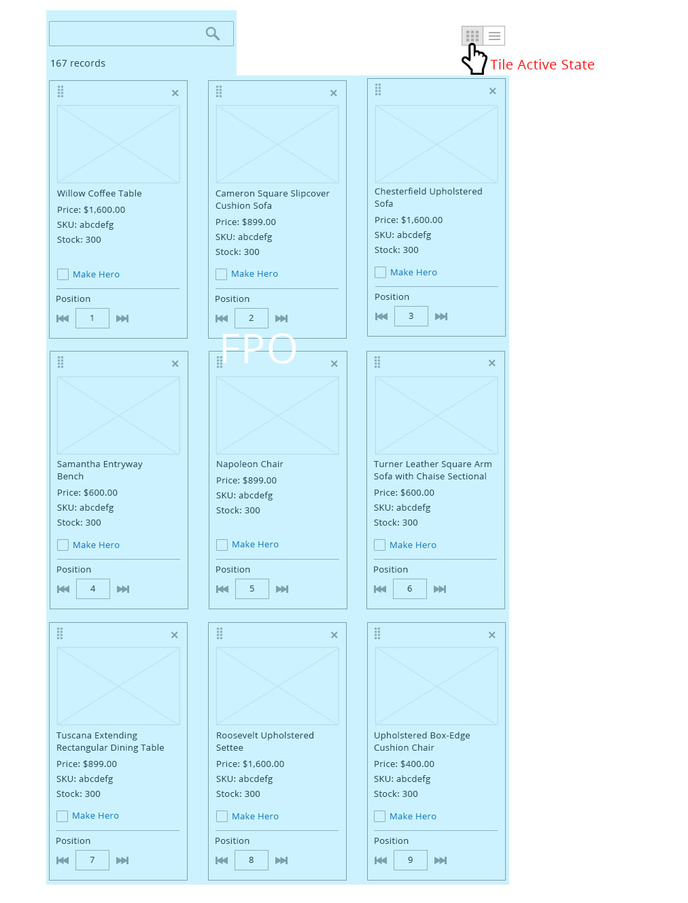

# View controller

Users may need to view a set of data in more than one way. The view controller is used to switch between the views of data set.

For solutions not described in this article, please refer to other related patterns or contact the Commerce UX Design Team.

## When to Use/When Not to Use

Only use for switching between views of data set.

## Variations

Follow are variations of icons to use for their corresponding data set views:

## Behavior

User switches between the views using the view controller. User can click on the view, that is corresponding to the view they want to see.

In this case, user select data table view control, the data table view is shown.

Then, the user can also switch back to tile view in this example.

## Placement

The view control should always be placed as the most right item on the same row as filter options.

## Style

## Accessibility

The controller should be accessible by keyboard and have a voice over for screen readers. Accessibility guideline follow buttons' guideline.

*  [Keyboard shortcuts in Windows](https://support.microsoft.com/en-us/help/12445/windows-keyboard-shortcuts)
*  [Mac keyboard shortcuts](http://support.apple.com/en-us/HT201236)

(Keyboard shortcut same as checkbox)

## Assets

[Download View Controller PSD source](https://devdocs.magento.com/download/magento-viewcontrol.psd)

Please reach out to the Commerce UX Design team if you need anything else.
