Form elements are central to the Commerce framework, particularly in the ‘Admin’ interface. This article contains examples of the various types of form elements encountered throughout the application to collect data input from its users.

For solutions not described in this article, please refer to other form-related patterns or contact the Commerce UX Design team.

## Use of form elements

Form elements will be needed anytime input is to be collected from the user. Consideration should be given to ensure the best form element is presented as part of the particular user-task. When designing forms for the application care should be taken to ensure the overall experience promotes **clarity**, **efficiency** and **success** for the user.

_* "best" is a relative term, but there are User Experience principles and best practices that should be followed when designing forms._

## Form Labels

In most cases every text field, text box, radio button group, checkbox or checkbox group, drop down selector and multi-select box will have a label. There are two variations of form [layout](https://glossary.magento.com/layout) – "label-left" and "label-top". Depending on the layout of the page and/or task-at-hand, either of these may be implemented, but whichever layout is deemed appropriate it should be used consistency throughout a given task.

**Example of label-top:**

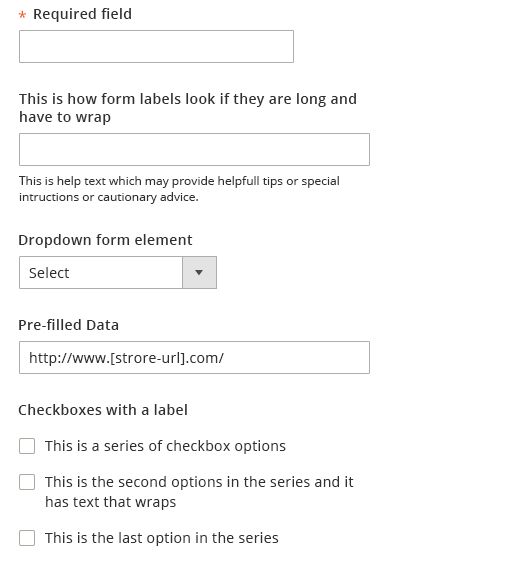

**Example of label-left:**

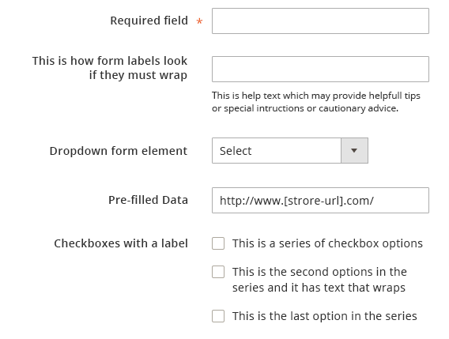

## "Required" Indicator

As a matter of best practices, any input that is required in order to be successfully submitted should clearly bear an indication. This is achieved by including an asterisk in relation to the form element. The asterisk should precede the label whenever the label appears above the form field. However, for left-aligned form labels the asterisk should follow the label, thus appearing between the label and form field –this improves scanability making it less likely that the user will overlook the required fields.

## Focus State

To assist the user, the form element with `.focus()` will display a subtle blue stroke to indicate that the element is currently "active". Focus can be re-directed by "tabbing" or
otherwise selecting outside the form element that has focus.

## Form Elements and the Page Grid

For *label-left* form elements the amount of horizontal real estate allowed for the labels should only span a maximum of 3 columns of the page grid. While the element itself should typically span no more than 4 columns. For *label-top* form elements, the label and the form element overall should typically not exceed 5 columns of the page grid, however page layout and/or the amount of information to be collected will influence this.

**Grid and label-left form:**

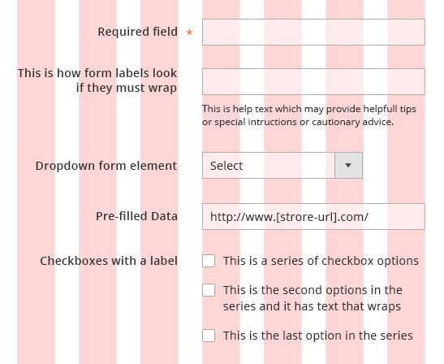

**Grid and label-top form:**

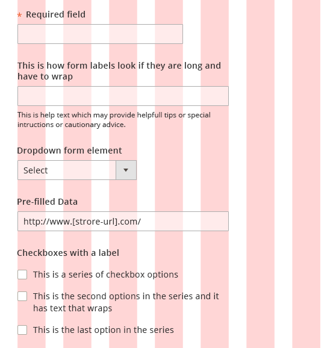

## Text Field

Text fields are used to collect alphanumeric input directly from the user. As a matter of design, the length of the field should be comparable to the length of information to be collected. This can passively set an expectation on the part of the user as to how much or what type of information is to be provided.

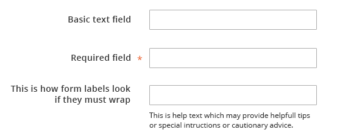

### Additional Text Field

In cases where some, but not every, user may want to provide additional information (such as Building or Room Number as part of an address) an additional field may be paired with the initial text field. In these cases, if it is ‘reasonably clear’ what this additional field is
for, a label may not be necessary for the additional field. However, as a rule each form element should have a label.

### "Re-sizable" Text Field

It may be advantageous to allow the text area to be ‘stretched’ by the user to accommodate the amount of data input. This is most useful when the amount of data or character-count is unlimited and/or the amount of text to be entered large or unpredictable (‘comments’ for instance). When presenting this a re-sizable area to the user it is crucial to include the "grabber" icon in the lower-right corner of the field to indicate this functionality to the user.

In cases where a re-sizable text field is not desired, reasonable space should be provided to collect the data. If the text entered then exceeds the area, the text should flow upward, keeping the most recent text in view.

### Text Field with Associated Checkbox

Often times a text field will be paired with a checkbox to enable some behavior associated with the data provided ("Keep me signed in" on a log in screen for example). In these instances, most often, including a label for the checkbox element is not required or needed. A slight indentation of the sub-elemental checkbox can help inform the user that the elements are related and not two distinct form elements.

### Text Field with Icon Trigger or Button

A control may be placed inside (overlaid on) a text field to "trigger" a more sophisticated
or robust interaction, as in the case of something like **date picker**. The icon should appear on the far right end of the field. Once a user has interacted with the control and a value is set, the value should display in the field, as well as the control (icon). This of course allows the user to edit the field if they so desire.

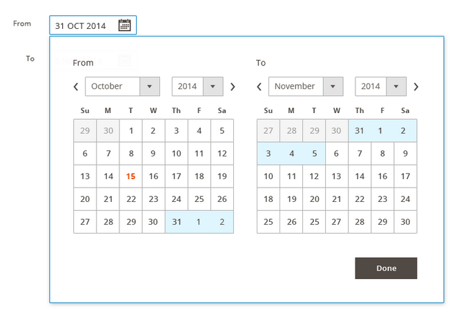

When an ancillary or sub-action must be performed using the data input (or selected from) a particular element a, "button" may be required to initiate the sub-action and should be located in close proximity to the form element. If the sub-action involves a single form field an icon should be used and should directly follow the form element.

If the sub-action involves a set of form elements, as with **sign-in**, a more traditional "button" should follow the group. The button should follow the application UI style for buttons. A link may be substituted for a button, however doing so may reduce the ’find-ability’ of the call to
action.

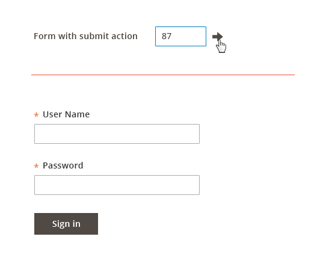

## Checkboxes

Checkboxes should be used in cases where one or many options may be selected. A checkboxes may also be used in cases where the user may wish to ‘opt in’ or enable an action or setting. Checkboxes may be used in relation to other form elements as well.

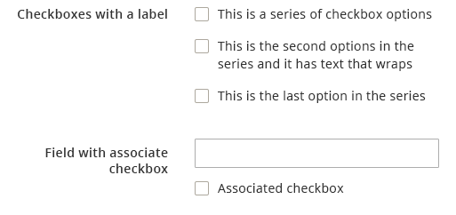

If there is a _parent-child_ relationship of associated checkboxes there should be some visual distinction for the user between "some" checked and "all" checked, in the [event](https://glossary.magento.com/event) that the child elements are hidden from view as in a expandable section.

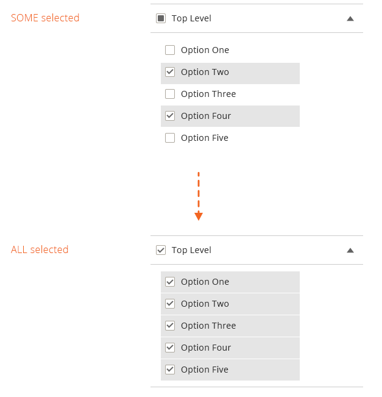

## Radio Buttons

Radio buttons should be used in cases of ‘yes’ or ‘no’. The pair of radio buttons may be arranged either vertically or horizontally. Radio buttons may often have a default or preferred selection. This preferred selection should be the first button of the pair whenever possible. In some instances when only a single selection may be made but there are several options to choose from, all of the radio button in the set may appear un-selected or ‘empty’. Once a user has made a selection however the selected state should be evident and be visible henceforth, even if the user changes the selection - it cannot be returned to the initial ‘un-selected’ state.

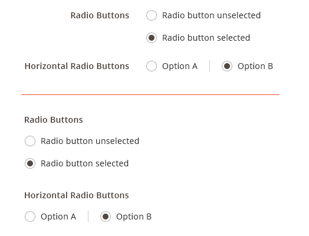

## Drop Down Selector - Single

A drop down selector may be used when two or more options are available, but only one of the options may be selected. However whenever only two options are available the use of a drop down element should be weighed against the use of radio buttons.

Best practices suggest that a drop down selector should not be used for ‘binary’ or Yes/No selections, radio buttons are preferable in these situations. If the selection is not mandatory, a checkbox is preferred. If visibility of the list of options is desired or advantageous for the user or if the list of options is lengthy (say more than 6) a ‘list box’ should be used instead of a dropdown.

## Multi-Select Drop Down

When selecting multiple options and a drop down element is the desired implementation, checkboxes can be included for ease of use in selecting multiple options. This is preferred over the keyboard Shift key + select method.

## List Box

The advantage of a list box is that it exposes more options to the user. The list can be made scroll-able when space is a consideration and/or the list is long. A list box is mandatory when the list of options exceeds 6 items.

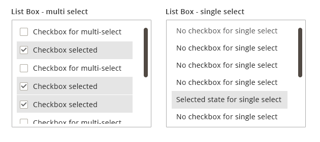

## Attribute Builder - 'Chips'

In instances where to user wishes to build a list of one or many, as in a list of email addresses for a distribution list or a set of color swatches for a product, an "attribute" builder may be employed.  This is presented as a typical form field, but when the user _clicks_ into it a drop down list is revealed. The user may then select from the list as with a typical drop down or may begin typing to narrow the list, auto-suggest functionality would also apply to make this process more efficient. The selected options are then rendered as 'chips' in the field. The user can select as many as desired and the 'chip' fill in like bricks, wrapping to the next line when there is not enough space. These chips can then be removed either by clicking/tapping the chip in the field or 'backspacing' on the keyboard will remove each chip in reverse order (right to left inline).

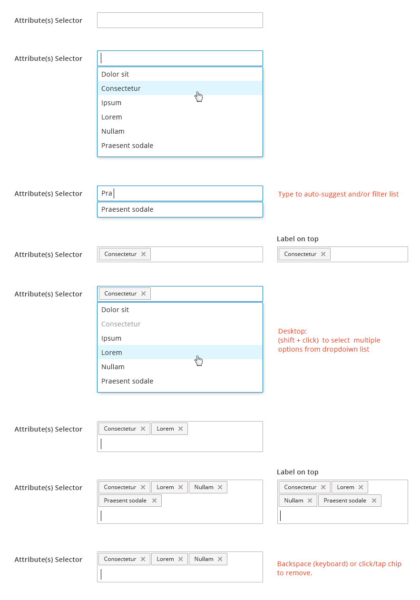

## Form Field Validation

Client-side validation should be used whenever possible to assist the user in completing an error-free form prior to submitting the data. A validation check should be triggered when the user redirects focus (clicks or tabs out of a field). A notification message should appear when an error was made. This message should appear in immediate proximity of the form element where the error occurred. This same style should be applied when messaging errors returned from server-side validation checks. Please refer to [Admin Errors and Messages Writing](../../style-guide/content/errors-and-messages.md) documentation for more details.

## Disabled Form Field

It may be necessary in some instances to display a form element but disable it so that the user cannot interact with it. Disabling can indicate a conflict with other related form elements, that an "opt in" is required to enable the feature, or that the proper level of authentication has not been obtained by the user.

## Units and Measurement Indicators

In some cases it may be beneficial to indicate to the user the "unit" of the data to be
input, such as currency or weight. This is accomplished by including standard symbolic indicator of the "unit", such as using €to denote the currency Euros. The indicator may either precede the input area or follow the input area.

## Field Masking

Some fields may benefit the user by providing an indication of the desired format of the data to be input. The mask should appear when the field gains "focus".

## Read-only Form Data

It may be necessary or advantageous to display form field data that cannot be changed or edited. In these cases the form label should appear to provide context for the "read-only" data, but not the field bounding-box so that it is clear to the user that the data cannot be edited.

## Progressive Disclosure

In some instances rather than displaying a form element in a disabled state, it may be preferred to hide the element until the user takes an action to ‘opt in’. Once the user takes the action to opt in the enabled field(s) is dynamically presented (becomes visible) to the user.

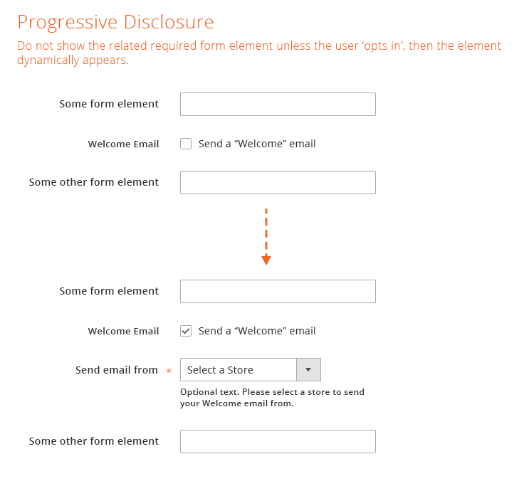

## Contextual Help tooltip

Akin to progressive disclosure is "contextual help". This may be used whenever it is likely the user will require or benefit from additional information regarding a form element. The advantage of "contextual help" over standard help text is that it provides more space for copy or when the majority of users would not need the information to complete the task. Its drawback is that it is hidden from 100% of the users and requires explicit action to reveal it. "Contextual help" should be used sparingly to minimize clutter. The user taps the icon to reveal the contextual help tooltip. Then taps again to close it.

## Help text

"Help text" may be associated with individual form elements. This text is used to provide specific details, helpful hints, or cautionary messages relating to the particular form element with which it is associated. Help text is always visible so care should be taken to ensure that the text is **necessary**, **helpful**, **clear** and **concise**.  As with "Contextual Help", help text should be used judiciously.

## Styling and Spacing

For specific details concerning styling including fonts, colors and effects and spacing and padding, please refer to the source PSD files and exports located on Box or contact the Commerce Product Design and User Experience team.

**Sample of specs:**

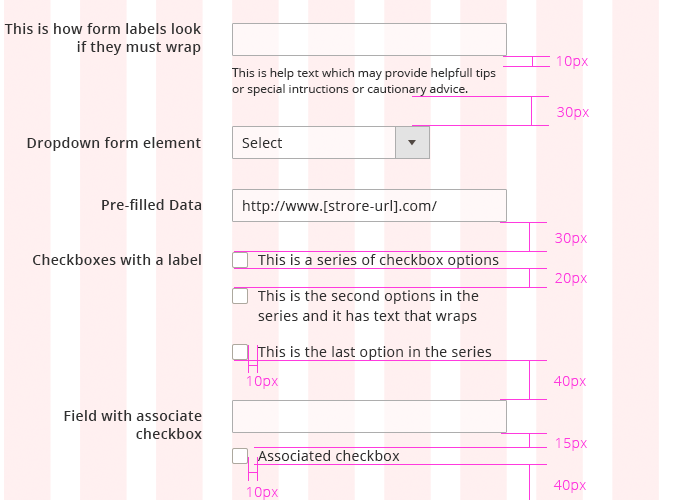

## Accessibility

Follow this guideline: [http://www.w3.org/TR/WCAG10-HTML-TECHS/#forms](http://www.w3.org/TR/WCAG10-HTML-TECHS/#forms).

## Assets

[Download Forms Patterns source (PSD) and PNGs]({{ site.downloads }}/forms_pattern.zip).

For any other resources, please contact the Commerce UX Design Team.
