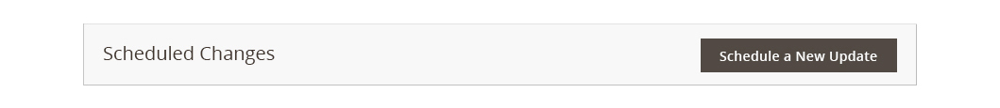
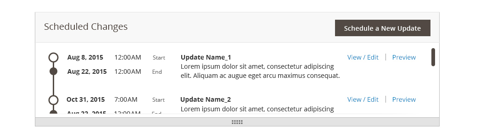
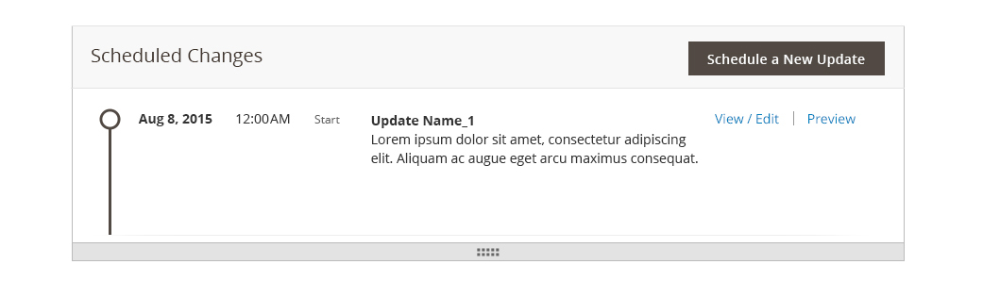
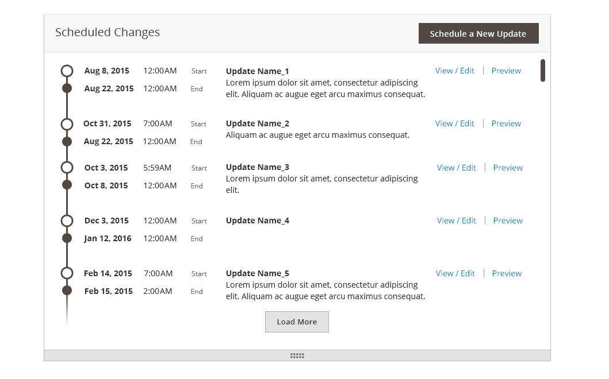
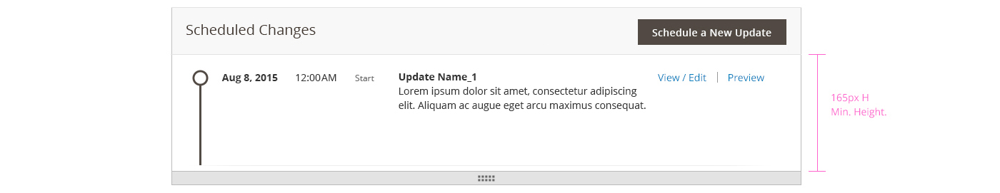

# Scheduled changes module

For all stage-able entities, a Scheduled Changes Module appears on the top of each entity's page. An entity's module provides a quick summary of scheduled updates, as well as controls to view, edit and preview individual updates.

## When to Use / When Not to Use

Use in places where a series of updates needs to be displayed, including a brief summary of their contents.
The scheduled changes module, as defined below, should only be used with stage-able entities.

## Interaction and Behavior

### No Updates View

When no updates are available to be displayed on the timeline.

### Multiple Updates View

Shows when several updates are scheduled for a stage-able entity.

### Single Update View

When a single update is scheduled, the module's default height is the same as the Multiple Updates View. Users can re-size the module, using the dragger at the bottom of the module.

### Loading More Updates

The "Load More" button appears at the bottom of the list of scheduled updates. By default, 5 scheduled updates are displayed. To view more, users can click "Load More" to add the next set of scheduled updates.

## Styling

### No Updates View:

### Single Update View - minimum height:

### Multiple Updates View style:

