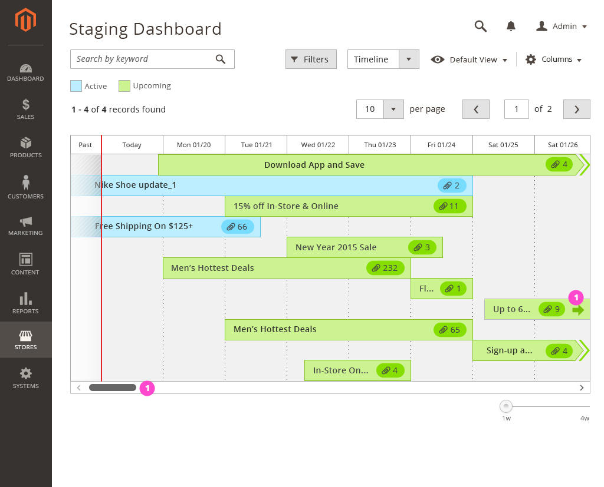
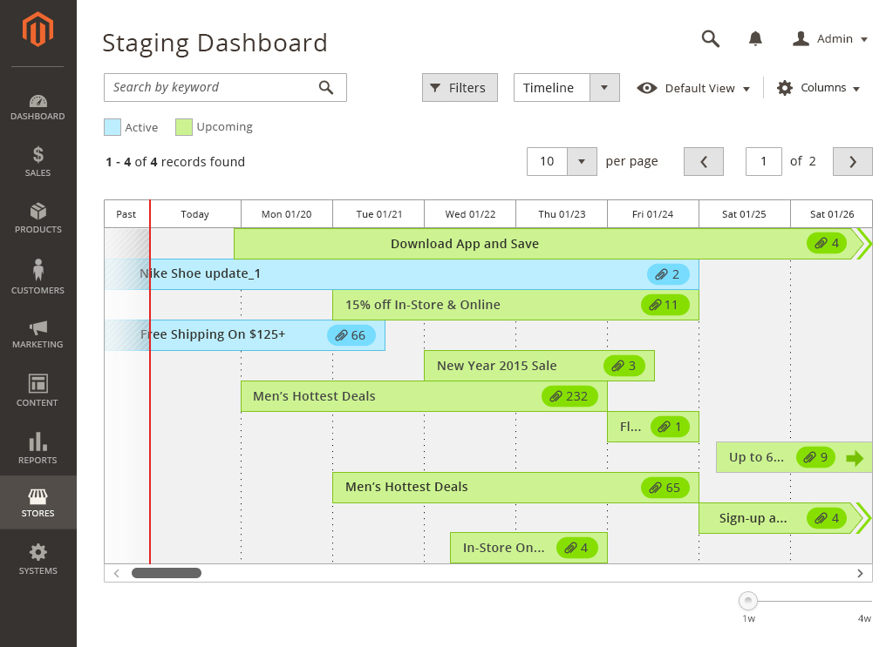
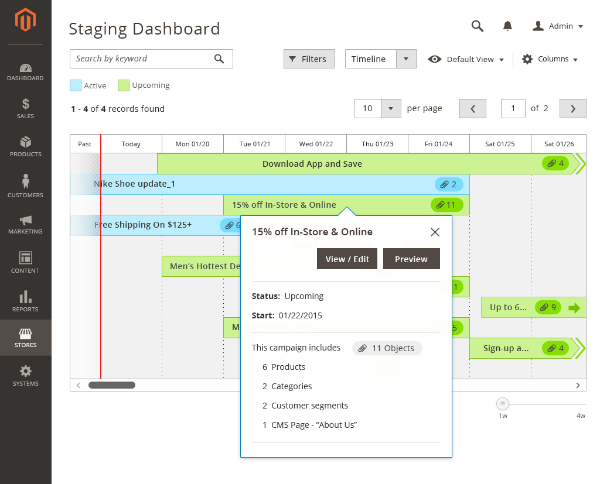
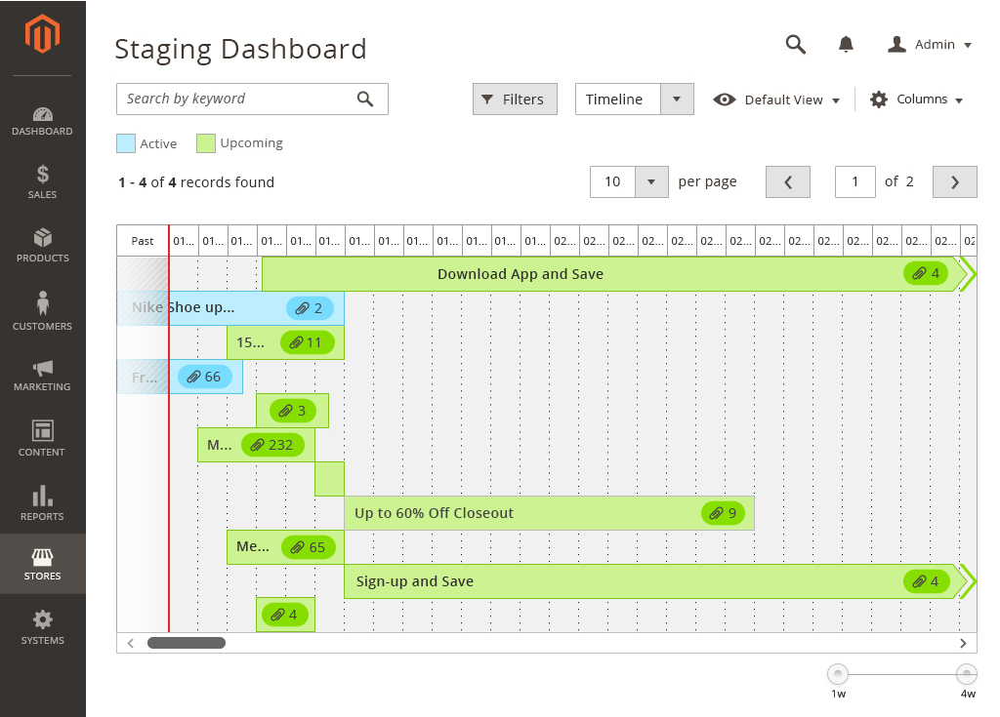
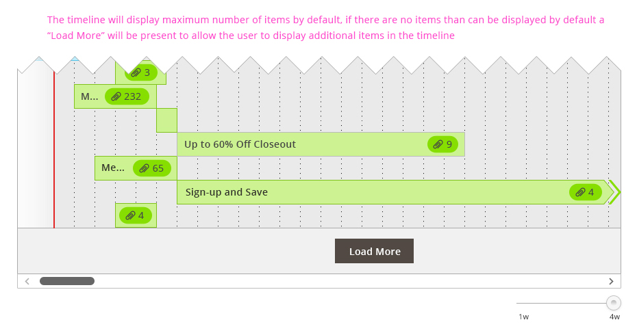
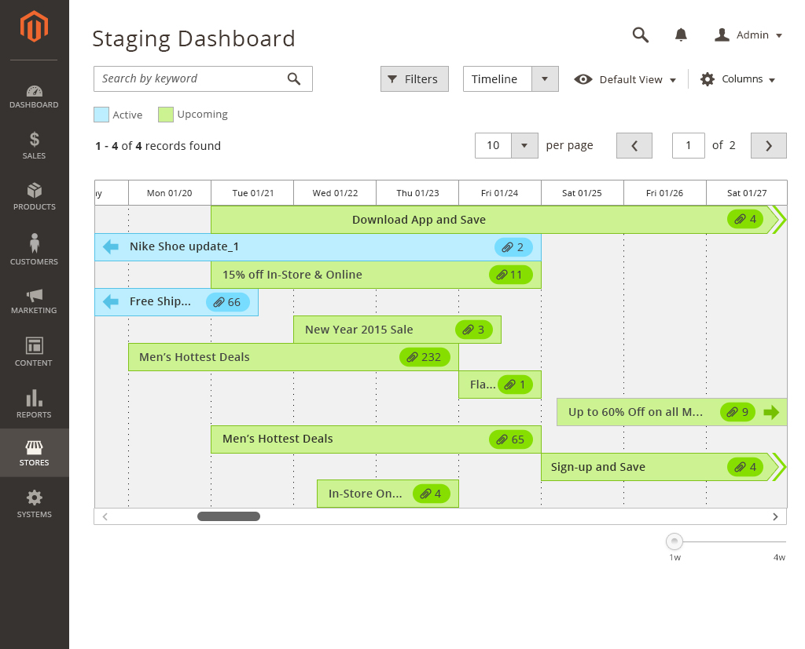
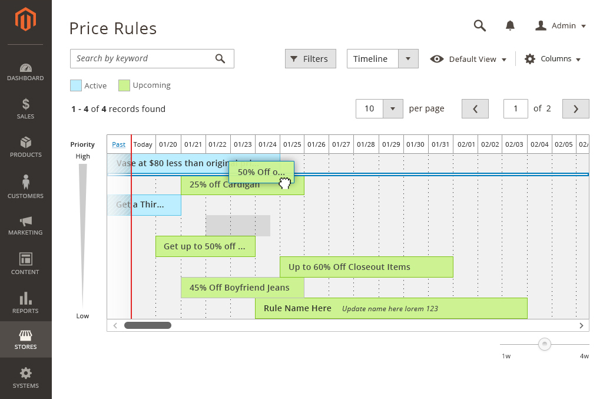
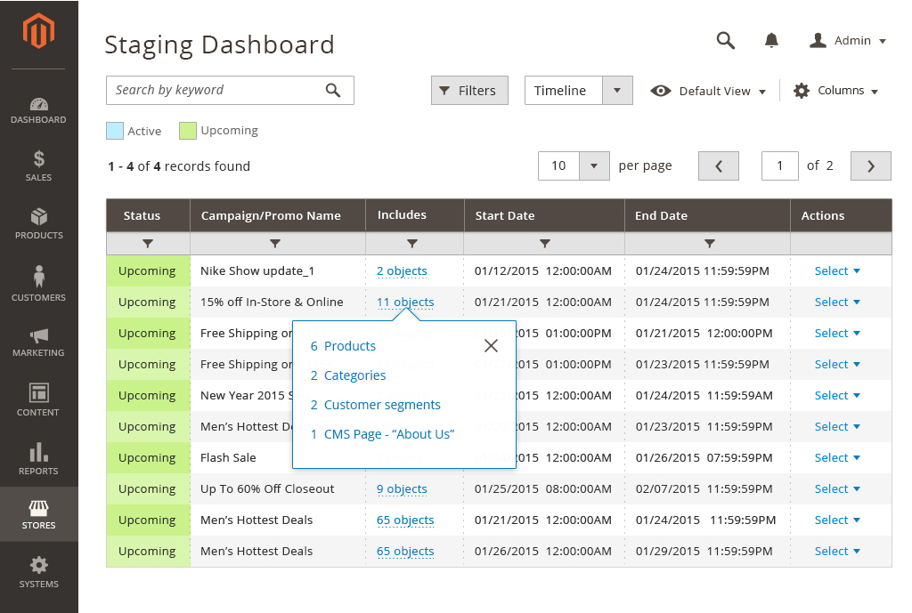
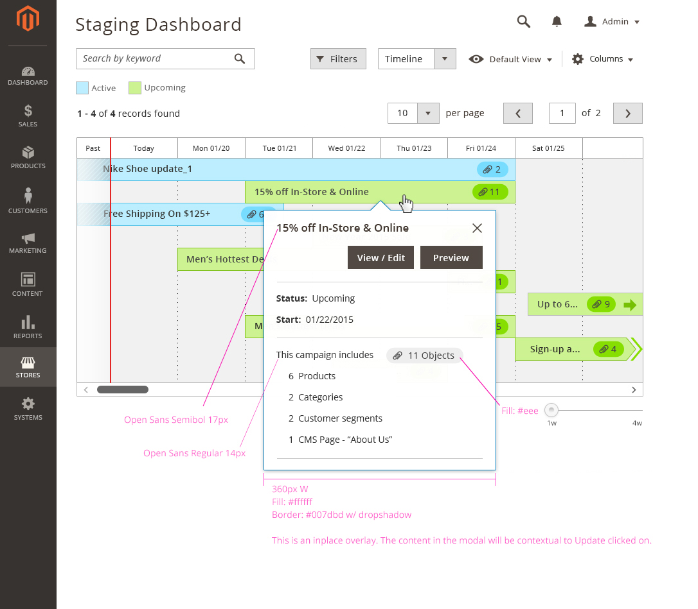

# Timeline dashboard

This dashboard provides a page where events and processes can be viewed and managed in one place.

Staging usage: Users need to see which stage-able entities are published or scheduled to be published. Since most of the application's entities can be staged – the display of all this information is important to show users the full scope of updates at a glance.

## When to Use / When Not to Use

Use when events and processes need to be displayed sequentially, along a timeline, and when multiple items are combined in one view. Example: Scheduled updates on staging.
Do not use a timeline as an alternative display mode for tree, card or data table views.

## Staging terminology and definitions

### Stage-able entity

A part of the application that can be scheduled to change, within an update. Examples: Products, Categories.

### Update

A combination of changes to a stage-able entity. Multiple updates are shown on the staging timeline. An update's state is either completed, active or scheduled to be activated.Most updates are scheduled for a temporary span of time, but some can be permanent.

### Objects

These are the individual changes contained within an update.

## Interaction and Behavior

### What markers mean on timeline

1. The user can scroll the timeline to see upcoming updates by tapping the arrow on an update, scrolling the timeline with scroll control, or the right arrow.

### Update schedule

As the default state, this view shows completed, active and scheduled updates on the dashboard. The timeline's default date range is 1 week, which can be changed and customized.Updates are displayed in chronological order, with the most recent start date on top.

### Update Summary, in Overlay Window

When clicked, a bar on the timeline spawns an overlay window, showing a summary of the objects contained in the update.  The window includes controls to edit or preview the update.

### 4-Week Zoom Control

A slider control at the bottom of the page allows users to zoom out from 1 week to 4 weeks, viewing a bigger timeline of updates.

### "Load More" Control

On the default timeline view, the number of updates displayed is set to 10. Clicking "Load More" adds more updates on the timeline. A grid menu control changes the number of items displayed per page.

### Horizontal Scrolling for Future Updates

A horizontal scrollbar at the bottom of the timeline provides the capability to view future updates that do not fit inside the span of the page. This scrollbar is usually not displayed.

### Prioritized Timeline View, with Drag and Drop

This is a variation of the timeline. This view only appears when stage-able entities on the timeline need to be ordered by priority. In the example displayed below – the priority scale has been used to display the sort order of the rules. To re-arrange the order, an item on the timeline can be dragged and moved.

### Data Table View

This is an alternative view to the timeline in data table format. The functionalities of the timeline and the data table are consistent except for the pagination feature, which is used for data table view only.

## Styling

### Updates schedule:

### Update Summary, in Overlay Window:

## Assets

[Download Timeline Dashboard source](https://devdocs.magento.com/download/timeline-dashboard.psd)
