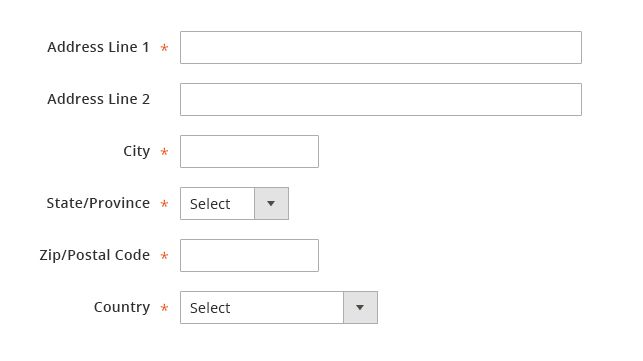
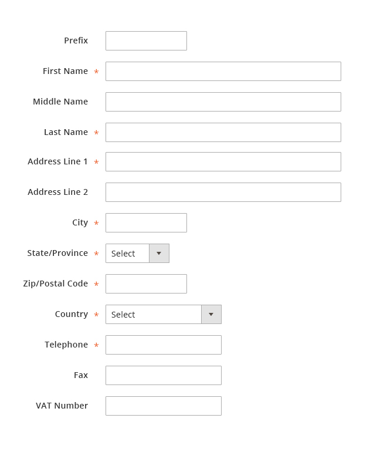

# Address form

This article discusses standards and rules for an address entry forms.

For solutions not described in this article, please refer to other related patterns or contact the Commerce UX Design team.

## When to Use / When Not to Use

The address entry fields should be used whenever an address needs to be captured. This set of form elements will be universal across the application user experience. This pattern should follow rules established in the Form Elements and related patterns.

## Variations

The only variation of this pattern at this time is the North American Address Entry format. Users have the ability to create address entry formats for other locales within the system.

### Fields That Make Up Address Entry (in order)

| Label           | Input Type                          | Required? |
|-----------------|-------------------------------------|-----------|
| Address Line 1  | Text Field                          | Yes       |
| Address Line 2  | Text Field                          | No        |
| City            | Text Field                          | Yes       |
| State/Province  | Dropdown (Default can be localized) | Yes       |
| ZIP/Postal Code | Text Field                          | Yes       |
| Country         | Dropdown (Default can be localized) | Yes       |

## Styling

This pattern will follow the Form standards established in the Form Elements and related patterns. Refer to the Form Elements and related patterns for style information.

## Usage Example

## Assets

Source files associated with this article are currently attached the Form Elements Pattern.
