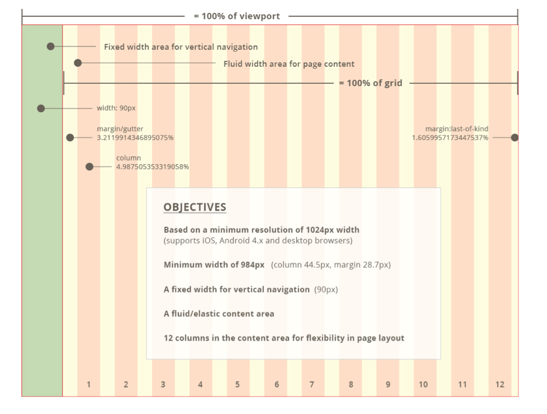
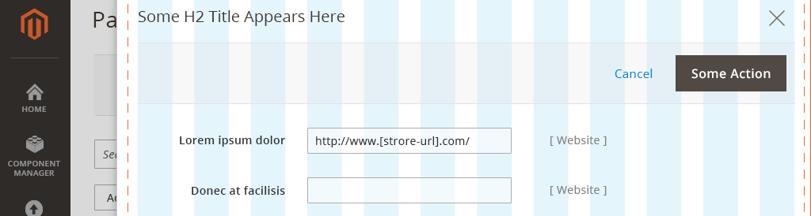
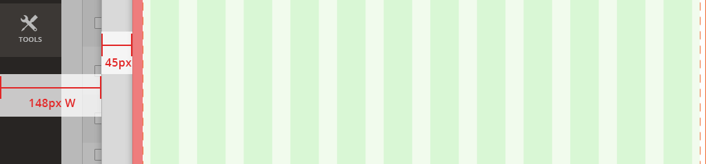

# Page grids

In the [Admin](https://glossary.magento.com/magento-admin), a grid is used on all pages to establish global layouts for page templates. The grid assigns a set number of columns and rows for a page, and designers can create a layout by dividing the columns into sections, where design patterns and content can be placed.

-  A 12-column fluid-width content grid is placed next to the page’s 1-column fixed-width left navigation
-  The 12-column grid’s minimum width spans 984px. The grid expands its layout across larger screens.
-  For views smaller than 984px, a page’s layout doesn’t change as the page shrinks to fit smaller screen widths.

## Slide-out grid

A Slide-out panel, similar to a modal window, breaks apart and simplifies a complex subtask that is included within a primary task.

For example:

-  On a product details form page, a user clicks "Add Attribute".
-  A panel slides over the parent page and shows "Add Attribute" functionality.
-  When the user finishes adding attributes, the panel disappears, and the user returns the product details form page.

<InlineAlert variant="info" slots="header, text1" />

Layout and behavior:

When a panel spawns, it slides from right to left atop and almost completely over the parent page. A narrow gutter of space remains at left, showing the left navigation and a small sliver of the parent page.

Standard [layout](https://glossary.magento.com/layout) within the edges of a browser screen

(Panel position in relation to browser edge)

<InlineAlert variant="info" slots="header, text1" />

Spacing:

Slide-out content is contained in a 12-column page grid, with additional 15px padding on the left edge. The gutter spacing at left is fluid, based on browser width.

(Nested page-grid with additional padding)

<InlineAlert variant="info" slots="header, text1" />

Nested slide-outs:

For multiple panels displayed, additional gutter space is used at left to show a small sliver of a Slide-out below another Slide-out.

